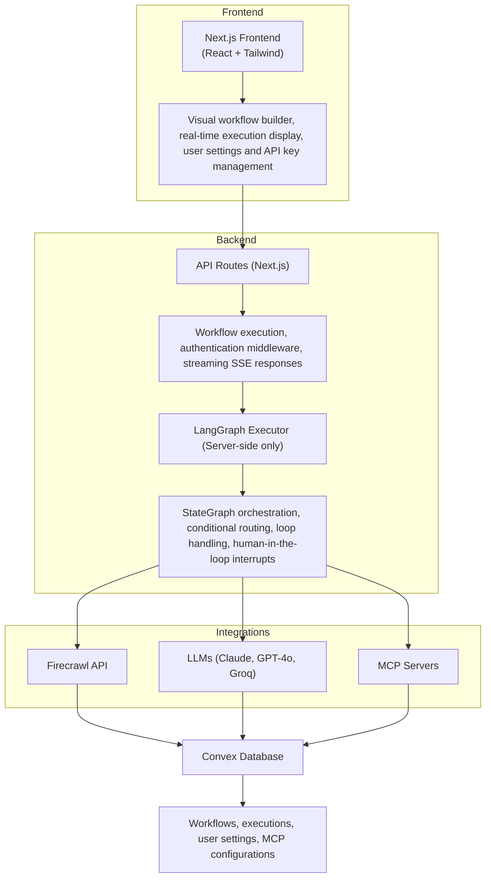

# Open Agent Builder

<p align="center">
  
</p>

<div align="center">

**Build, test, and deploy AI agent workflows with a visual no-code interface**

[](https://choosealicense.com/licenses/mit/)
[](https://firecrawl.dev)

[Documentation](#-documentation) • [Examples](#example-workflows)

</div>

---

## What is Open Agent Builder?

Open Agent Builder is a visual workflow builder for creating AI agent pipelines powered by [Firecrawl](https://firecrawl.dev). Design complex agent workflows with a drag-and-drop interface, then execute them with real-time streaming updates.

**Perfect for:**
- Web scraping and data extraction workflows
- Multi-step AI agent pipelines
- Automated research and content generation
- Data transformation and analysis
- Web automation with human-in-the-loop approvals

> **Note:** This project is actively under development. Some features are still in progress and we welcome contributions and PRs!

---

## Key Features

### Visual Workflow Builder
- **Drag-and-drop interface** for building agent workflows
- **Real-time execution** with streaming updates
- **10 core node types**: Start, Agent, MCP Tools, Transform, Extract, HTTP, If/Else, While Loop, User Approval, End
- **Template library** with pre-built workflows
- **MCP protocol support** for extensible tool integration
- **Custom tool integration** - Attach standard and MCP tools to AI agents
- **Multi-LLM support** - Choose from Claude, GPT-4o, Gemini, or Groq

### End-User Workflow Execution
- **Workflow Runner UI** - Clean, simple interface for executing published workflows
- **User Workflow Interface** - Allow end users to run workflows without seeing builder complexity
- **Embedded execution** - Share workflows via direct links
- **Real-time progress** - Watch workflow execution with live updates

### Powered by Firecrawl
- **Native Firecrawl integration** for web scraping and searching

### Enterprise Features
- **LangGraph execution engine** for reliable state management
- **Clerk authentication** for secure multi-user access
- **Convex database** for persistent storage
- **API endpoints** for programmatic execution
- **Human-in-the-loop** approvals for sensitive operations

---

## Tech Stack

| Technology | Purpose |
|-----------|---------|
| **[Firecrawl](https://firecrawl.dev)** | Web scraping API for converting websites into LLM-ready data |
| **[Next.js 16 (canary)](https://nextjs.org/)** | React framework with App Router for frontend and API routes |
| **[TypeScript](https://www.typescriptlang.org/)** | Type-safe development across the stack |
| **[LangGraph](https://github.com/langchain-ai/langgraph)** | Workflow orchestration engine with state management, conditional routing, and human-in-the-loop support |
| **[Convex](https://convex.dev)** | Real-time database with automatic reactivity for workflows, executions, and user data |
| **[Clerk](https://clerk.com)** | Authentication and user management with JWT integration |
| **[Tailwind CSS](https://tailwindcss.com/)** | Utility-first CSS framework for responsive UI |
| **[React Flow](https://reactflow.dev/)** | Visual workflow builder canvas with drag-and-drop nodes |
| **[Anthropic](https://www.anthropic.com/)** | Claude 3.5 Haiku, Sonnet 3.5, Sonnet 4.5 - All tools & MCP supported |
| **[OpenAI](https://platform.openai.com/)** | GPT-4o, GPT-4o-mini - All tools & MCP supported |
| **[Google AI](https://ai.google.dev/)** | Gemini 2.0 Flash Experimental, 2.0 Flash Lite - All tools & MCP supported |
| **[Groq](https://groq.com/)** | Llama 3.3 70B, Llama 3.1 8B Instant, GPT OSS 120B/20B - All tools & MCP supported |
| **[E2B](https://e2b.dev)** | Sandboxed code execution for secure transform nodes |
| **[Vercel](https://vercel.com)** | Deployment platform with edge functions |

---

## Prerequisites

Before you begin, you'll need:

1. **Node.js 18+** installed on your machine
2. **Firecrawl API key** (Required for web scraping) - [Get one here](https://firecrawl.dev)
3. **Convex account** - [Sign up free](https://convex.dev)
4. **Clerk account** - [Sign up free](https://clerk.com)

> **Note:** LLM API keys can be added directly in the UI via Settings → API Keys after setup. For MCP tool support, Anthropic Claude (3.5 Haiku or Sonnet 3.5) is currently recommended as the default option.

---

## Installation & Setup
```bash
# Install Convex CLI globally
npm install -g convex

# Initialize Convex project
npx convex dev
```

This will:
- Open your browser to create/link a Convex project
- Generate a `NEXT_PUBLIC_CONVEX_URL` in your `.env.local`
- Start the Convex development server

Keep the Convex dev server running in a separate terminal.

### 3. Set Up Clerk (Authentication)

Clerk provides secure user authentication and management.

1. Go to [clerk.com](https://clerk.com) and create a new application
2. In your Clerk dashboard:
   - Go to **API Keys**
   - Copy your keys
3. Go to **JWT Templates** → **Convex**:
   - Click "Apply"
   - Copy the issuer URL

Add to your `.env.local`:

```bash
# Clerk Authentication
NEXT_PUBLIC_CLERK_PUBLISHABLE_KEY=pk_test_...
CLERK_SECRET_KEY=sk_test_...

# Clerk + Convex Integration
CLERK_JWT_ISSUER_DOMAIN=https://your-clerk-domain.clerk.accounts.dev
```

### 4. Configure Convex Authentication

Edit `convex/auth.config.ts` and update the domain:

```typescript
export default {
  providers: [
    {
      domain: "https://your-clerk-domain.clerk.accounts.dev", // Your Clerk issuer URL
      applicationID: "convex",
    },
  ],
};
```

Then push the auth config to Convex:

```bash
npx convex dev
```

### 5. Set Up Firecrawl (Required)

**Firecrawl is the core web scraping engine** that powers most workflows.

1. Get your API key at [firecrawl.dev](https://firecrawl.dev)
2. Add to `.env.local`:

```bash
# Firecrawl API (REQUIRED)
FIRECRAWL_API_KEY=fc-...
```

> **Note:** Users can also add their own Firecrawl keys in Settings → API Keys, but having a default key in `.env.local` enables the template workflows.

### 6. Set Up Security (Required for Production)

**Critical security configurations required before deployment:**

```bash
# Generate encryption key (32 bytes for AES-256-GCM)
node -e "console.log(require('crypto').randomBytes(32).toString('base64'))"

# Add to .env.local
ENCRYPTION_KEY=<generated-key>

# E2B Sandbox (REQUIRED for Transform nodes)
E2B_API_KEY=e2b_...
```

Get your E2B key at [e2b.dev](https://e2b.dev)

> **Security Note:** Transform nodes execute user-provided code and **require** E2B sandbox for security. Without `E2B_API_KEY`, transform nodes will fail with an error message.

**Verify security setup:**
```bash
node scripts/verify-security-setup.js
```

For complete security documentation, see [SECURITY.md](./SECURITY.md)

### 7. Optional: Configure Default LLM Provider

While users can add their own LLM API keys through the UI (Settings → API Keys), you can optionally set a default provider in `.env.local`:

```bash
# Optional: Choose one as default

# Anthropic Claude - 3.5 Haiku, Sonnet 3.5, Sonnet 4.5
ANTHROPIC_API_KEY=sk-ant-...

# OpenAI - GPT-4o, GPT-4o-mini
OPENAI_API_KEY=sk-...

# Google Gemini - 2.0 Flash Experimental, 2.0 Flash Lite
GOOGLE_API_KEY=AIza...

# Groq - Llama 3.3 70B, Llama 3.1 8B Instant, GPT OSS 120B/20B
GROQ_API_KEY=gsk_...
```

> **Note:** All LLM providers support both standard tools (Firecrawl, Tavily, Serper, E2B) and MCP (Model Context Protocol) for extensible tool integration. Choose any provider based on your preference for model quality, speed, and cost.

### 8. Optional: HTTP Domain Whitelist

For enhanced security, restrict HTTP nodes to specific domains:

```bash
# Optional: Whitelist allowed domains for HTTP requests
ALLOWED_HTTP_DOMAINS=api.example.com,*.trusted.com
```

If not set, HTTP nodes can make requests to any external domain (internal IPs and metadata endpoints are always blocked).

---

## Running the Application

### Development Mode

```bash
# Terminal 1: Convex dev server
npx convex dev

# Terminal 2: Next.js dev server
npm run dev
```

Or run both with one command:

```bash
npm run dev:all
```

Visit [http://localhost:3000](http://localhost:3000)

### Production Build

```bash
npm run build
npm start
```

---

## Quick Start Guide

### Your First Workflow

1. **Sign Up/Login** at `http://localhost:3000`
2. **Add your LLM API key** in Settings → API Keys
   - For MCP tool support: Use Anthropic Claude (3.5 Haiku or Sonnet 3.5)
   - For basic workflows: OpenAI, Google Gemini, or Groq also work
3. **Click "New Workflow"** or select a template
4. **Try the "Simple Web Scraper" template:**
   - Pre-configured to scrape any website
   - Uses Firecrawl for extraction
   - AI agent summarizes the content
5. **Attach tools to agents** (optional):
   - Select an Agent node
   - Click "Add Tools" in the node panel
   - Choose from Firecrawl MCP tools or standard tools
6. **Click "Run"** and enter a URL
7. **Watch real-time execution** with streaming updates

### End-User Workflow Execution

After building a workflow, share it with end users:

1. **Publish your workflow** - Save and copy the workflow ID
2. **Share the Workflow Runner link**:
   ```
   https://your-domain.com/workflow-runner?workflow=<workflow-id>
   ```
3. **End users can execute** without seeing the builder:
   - Clean, simple input form
   - Real-time execution progress
   - Results display
   - No workflow editing access

**Alternative: User Workflow Interface**
```
https://your-domain.com/ui-user-workflows?workflow=<workflow-id>
```
Provides a more customizable execution interface with embedded workflow visualization.

### Understanding Node Types

| Node Type | Purpose | Example Use | Tool Support |
|-----------|---------|-------------|--------------|
| **Start** | Workflow entry point | Define input variables | N/A |
| **Agent** | AI reasoning with LLMs | Analyze data, make decisions | ✅ MCP + Standard Tools |
| **MCP Tool** | External tool calls | Firecrawl scraping, APIs | N/A |
| **Transform** | Data manipulation | Parse JSON, filter arrays | N/A |
| **Extract** | LLM-powered extraction | Extract structured data with JSON schema | N/A |
| **HTTP** | HTTP API requests | Call REST APIs with custom headers/auth | N/A |
| **If/Else** | Conditional logic | Route based on conditions | N/A |
| **While Loop** | Iteration | Process multiple pages | N/A |
| **User Approval** | Human-in-the-loop | Review before posting | N/A |
| **End** | Workflow completion | Return final output | N/A |

---

## LLM & Tool Support

### Supported LLM Providers

| Provider | Models | MCP Support | Standard Tools | Notes |
|----------|--------|-------------|----------------|-------|
| **Anthropic Claude** | 3.5 Haiku, Sonnet 3.5 | ✅ Native | ✅ Yes | Recommended for MCP |
| **OpenAI** | GPT-4o, GPT-4o Mini | 🔄 In Dev | ✅ Yes | Function calling |
| **Google Gemini** | 1.5 Pro, 1.5 Flash | 🔄 In Dev | ✅ Yes | Function calling |
| **Groq** | GPT-OSS-120B | 🔄 In Dev | ✅ Yes | Fast inference |

### Tool Integration with Agents

**Agent nodes can use two types of tools:**

#### 1. MCP Tools (Model Context Protocol)
MCP tools enable agents to interact with external services:

- **Firecrawl** (built-in): `scrape`, `search`, `crawl`
- **Custom MCP servers**: Add your own via Settings → MCP Registry

**How to use:**
1. Add an **Agent** node to your workflow
2. In the node settings, click **"Add Tools"**
3. Select **MCP Tools** tab
4. Choose **Firecrawl** or custom MCP servers
5. The agent autonomously decides when to use tools

#### 2. Standard Tools
Pre-built tools for common operations:

- **Web Search** - Search the web and get results
- **Calculator** - Perform mathematical calculations
- **Date/Time** - Get current date/time information
- **More coming soon...**

**How to use:**
1. Add an **Agent** node to your workflow
2. In the node settings, click **"Add Tools"**
3. Select **Standard Tools** tab
4. Choose tools to attach
5. Agent can call these tools as needed

**Example workflow with tools:**
```
Start → Agent (with Firecrawl MCP + Calculator) → End
```

The agent can intelligently:
- Scrape websites when it needs data
- Search the web for information
- Calculate numbers when needed
- Combine multiple tool calls to complete tasks

---

## Example Workflows

### 1. Simple Web Scraper
**What it does:** Scrape any website and get an AI summary

**Nodes:** Start → Firecrawl Scrape → Agent Summary → End

**Try it:**
```bash
Input: https://firecrawl.dev
Output: "Firecrawl is a web scraping API that converts websites into LLM-ready markdown..."
```

### 2. Multi-Page Research
**What it does:** Search web, scrape top results, synthesize findings

**Nodes:** Start → Firecrawl Search → Loop (Scrape Each) → Agent Synthesis → End

### 3. Competitive Analysis
**What it does:** Research companies, extract structured data, generate report

**Nodes:** Start → Parse Companies → Loop (Research + Extract) → Approval → Export → End

**Features used:**
- Firecrawl web search
- Structured JSON extraction
- While loops for iteration
- Human approval gates
- Conditional routing

### 4. Price Monitoring
**What it does:** Track product prices across multiple sites

**Nodes:** Start → Loop (Scrape + Extract Price) → Compare → Notify → End

---

## Configuration

### User-Level API Keys

Users can add their own API keys via **Settings → API Keys**:

- **LLM Providers:** Anthropic (Recommended for MCP), OpenAI, Google Gemini, Groq (Required - add at least one)
- **Firecrawl:** Personal API key (Optional - falls back to environment variable)
- **Custom MCP Servers:** Authentication tokens

This allows:
- Each user to use their own API quotas
- Fallback to environment variables if not set
- Easy key rotation and management

### MCP Server Registry

Add custom MCP servers in **Settings → MCP Registry**:

1. Click "Add MCP Server"
2. Enter server URL and authentication
3. Test connection to discover available tools
4. Use in Agent nodes by selecting from MCP tools dropdown

**Supported MCP Servers:**
- Firecrawl (built-in)
- Custom HTTP endpoints
- Environment variable substitution: `{API_KEY}`

---

## Deployment

### Deploying to Vercel

1. **Push your code to GitHub**

2. **Deploy to Vercel:**
   ```bash
   # Install Vercel CLI
   npm i -g vercel
   
   # Deploy
   vercel
   ```

3. **Set environment variables** in Vercel dashboard:
   - `NEXT_PUBLIC_CONVEX_URL` (from Convex)
   - Clerk keys
   - `FIRECRAWL_API_KEY` (Required)
   - Optional: Default LLM provider keys

4. **Deploy Convex to production:**
   ```bash
   npx convex deploy
   ```

5. **Update Clerk settings:**
   - Add your Vercel domain to allowed origins
   - Update redirect URLs

### Environment Variables Checklist

**Required:**
- `NEXT_PUBLIC_CONVEX_URL` - Convex database
- `NEXT_PUBLIC_CLERK_PUBLISHABLE_KEY` - Clerk auth
- `CLERK_SECRET_KEY` - Clerk auth
- `CLERK_JWT_ISSUER_DOMAIN` - Clerk + Convex integration
- `FIRECRAWL_API_KEY` - Web scraping
- `ENCRYPTION_KEY` - AES-256 encryption for user API keys (32 bytes base64)
- `E2B_API_KEY` - Secure sandboxed code execution (REQUIRED for transform nodes)

**Optional (can be added in UI instead):**
- `ANTHROPIC_API_KEY` - Default Claude provider (Recommended for MCP)
- `OPENAI_API_KEY` - Default GPT-4o provider (MCP in development)
- `GOOGLE_API_KEY` - Default Gemini provider (MCP in development)
- `GROQ_API_KEY` - Default Groq provider (MCP in development)
- `ALLOWED_HTTP_DOMAINS` - Whitelist for HTTP node requests (security)

---

## Security

Open Agent Builder implements enterprise-grade security measures with comprehensive protection against common web vulnerabilities.

### 🔐 Security Features

**Code Injection Protection:**
- ✅ **No Function() Constructor** - All dynamic code evaluation uses sandboxed environments
- ✅ **E2B Sandbox** - Transform nodes execute in isolated E2B Code Interpreter
- ✅ **mathjs Evaluator** - Safe expression evaluation for conditions (replaces vulnerable expr-eval)
- ✅ **Prototype Pollution Protection** - Clean scopes with `Object.create(null)`

**Input Validation & SSRF Protection:**
- ✅ **Zod Validation** - All API inputs validated with comprehensive schemas
- ✅ **Length Limits** - Maximum sizes to prevent DoS attacks
- ✅ **SSRF Protection** - HTTP nodes blocked from accessing private IPs (127.0.0.1, 10.x, 192.168.x, localhost)
- ✅ **Format Validation** - Regex patterns for IDs, URLs, and user input

**XSS & Output Security:**
- ✅ **DOMPurify** - HTML sanitization in workflow results display
- ✅ **Tag Whitelist** - Only safe HTML tags allowed in output
- ✅ **Attribute Filter** - Script handlers and dangerous attributes removed

**Authentication & Authorization:**
- ✅ **Ownership Checks** - Users can only modify their own workflows/MCP servers
- ✅ **JWT Authentication** - Clerk-based authentication for all protected routes
- ✅ **API Key Authentication** - Optional API key auth for programmatic access
- ✅ **AES-256-GCM Encryption** - User API keys encrypted at rest

**Network Security:**
- ✅ **CORS Configuration** - Environment-specific origin whitelist (no wildcards)
- ✅ **Distributed Rate Limiting** - Convex-based (10 workflow executions/min per user)
- ✅ **Secure Random Generation** - Cryptographically secure API key generation

**Dependency Security:**
- ✅ **Regular Audits** - Automated npm audit checks
- ✅ **Secure Libraries** - Vulnerable packages replaced (expr-eval removed)
- ✅ **Up-to-date Dependencies** - Critical security patches applied

### 📋 Security Checklist

Before deploying to production:

- [x] Set `ENCRYPTION_KEY` (32-byte base64) in Convex environment
- [x] Set `E2B_API_KEY` (required for transform nodes) in Convex environment
- [x] Review `.env.local` - should only contain Next.js config (no API keys)
- [x] All API keys stored in Convex environment variables
- [ ] Enable HTTPS only (disable HTTP)
- [ ] Configure Content Security Policy headers
- [ ] Set up monitoring and alerts
- [ ] Review rate limit configurations
- [ ] Optional: Configure `ALLOWED_HTTP_DOMAINS` whitelist

### 🔍 Security Status

**Latest Security Audit:** December 3, 2025

- ✅ **15/15 vulnerabilities fixed** (8 CRITICAL, 5 HIGH, 2 MEDIUM)
- ✅ **0 exploitable vulnerabilities** remaining
- ⚠️ **3 low-risk known issues** (html-docx-js dependencies - isolated to Word export)

**Run security audit:**
```bash
# Check for vulnerabilities
npm audit

# Apply automatic fixes
npm audit fix

# View comprehensive security report
cat docs/SECURITY-FIXES-REPORT.md
```

### 📚 Security Documentation

**Complete Documentation:**
- **[docs/SECURITY-FIXES-REPORT.md](./docs/SECURITY-FIXES-REPORT.md)** - Comprehensive security audit and fixes (Dec 2025)
- **[CLEANUP-SUMMARY.md](./CLEANUP-SUMMARY.md)** - API key migration to Convex
- **[lib/api/validation-schemas.ts](./lib/api/validation-schemas.ts)** - Input validation schemas
- **[CLAUDE.md](./CLAUDE.md)** - Security architecture and best practices

**OWASP Top 10 (2021) Coverage:**
- ✅ A01:2021 - Broken Access Control
- ✅ A03:2021 - Injection
- ✅ A05:2021 - Security Misconfiguration
- ✅ A06:2021 - Vulnerable and Outdated Components
- ✅ A07:2021 - Cross-Site Scripting (XSS)

### 🚨 Reporting Security Issues

If you discover a security vulnerability, please report it via GitHub Security Advisories instead of opening a public issue.

---

## 📚 Documentation

### Quick Navigation

| I want to... | Read this document |
|--------------|-------------------|
| **Get started quickly** | This README |
| **Learn how to use the app** | [USER-MANUAL.md](./USER-MANUAL.md) |
| **Understand the architecture** | [ARCHITECTURE.md](./ARCHITECTURE.md) ⭐ |
| **Understand security features** | [SECURITY.md](./SECURITY.md) |
| **Develop or contribute** | [CLAUDE.md](./CLAUDE.md) |
| **Add new tools** | [ADDING-NEW-TOOLS.md](./ADDING-NEW-TOOLS.md) |
| **Deploy to production** | [Deployment](#deployment) + [SECURITY.md](./SECURITY.md) |
| **Troubleshoot issues** | [USER-MANUAL.md](./USER-MANUAL.md#troubleshooting) |

### Core Documentation

- **[USER-MANUAL.md](./USER-MANUAL.md)** - Complete user guide (2000+ lines)
  - Getting started tutorial
  - All 14 node types explained in detail
  - Advanced features and best practices
  - Troubleshooting guide with solutions
  - 40+ FAQ questions

- **[ARCHITECTURE.md](./ARCHITECTURE.md)** ⭐ - Complete system design (800+ lines)
  - Tech stack and design patterns
  - Project structure and organization
  - Core systems (execution, rate limiting, security)
  - Database schema and API design
  - Scalability and monitoring

- **[CLAUDE.md](./CLAUDE.md)** - Developer guide (500+ lines)
  - Development setup and commands
  - Project structure and configuration
  - Adding new node types
  - Common development tasks

- **[SECURITY.md](./SECURITY.md)** - Security guide (500+ lines)
  - All 8 security features explained
  - Production deployment checklist
  - Monitoring and incident response
  - OWASP Top 10 coverage

- **[ADDING-NEW-TOOLS.md](./ADDING-NEW-TOOLS.md)** - Tool development
  - Step-by-step guide to add tools
  - Tool architecture explained
  - Best practices and examples

- **[VERIFICATION-REPORT.md](./VERIFICATION-REPORT.md)** - Security verification

### Specialized Guides

Additional guides are available in [docs/guides/](./docs/guides/):
- **[UI Builder documentation](./docs/guides/)** (4 guides) - Build custom UIs for workflows
- **[Workflow Runner guide](./docs/guides/WORKFLOW-RUNNER-README.md)** - End-user workflow execution interface
- **[Vercel deployment guide](./docs/guides/VERCEL_DEPLOYMENT_GUIDE.md)** - Production deployment

### Architecture Documentation

Comprehensive architecture docs in [docs/architecture/](./docs/architecture/):
- **[System Architecture](./docs/architecture/README.md)** - Complete technical overview
- **[Database Schema](./docs/architecture/database-schema.md)** - Convex schema documentation
- **[Execution Engine](./docs/architecture/execution-engine.md)** - LangGraph workflow orchestration

---

## API Usage

### Programmatic Execution

Generate an API key in **Settings → API Keys**, then:

```bash
curl -X POST https://your-domain.com/api/workflows/my-workflow-id/execute-stream \
  -H "Authorization: Bearer sk_live_..." \
  -H "Content-Type: application/json" \
  -d '{"url": "https://example.com"}'
```

**Response:** Server-Sent Events (SSE) stream with real-time updates

## Architecture



---


## Project Status & Roadmap

### In Progress
- **MCP Support for OpenAI & Groq** - Adding native MCP protocol support
- **OAuth MCP Authentication** - Support for OAuth-based MCP servers
- **Additional MCP Integrations** - More pre-built MCP server connections
- **Workflow Sharing** - Public template marketplace
- **Scheduled Executions** - Cron-based workflow triggers

### Partial Support
- **E2B Code Interpreter** - Transform node sandboxing (requires E2B API key)
- **Complex Loop Patterns** - Nested loops and advanced iteration
- **Custom Node Types** - Plugin system for community nodes

### Coming Soon
- Full MCP support for all LLM providers
- OAuth authentication for MCP servers

We welcome contributions and PRs to help build these features!

## License

This project is licensed under the MIT License 

<div align="center">

**[Star us on GitHub](https://github.com/firecrawl/open-agent-builder)** | **[Try Firecrawl](https://firecrawl.dev)** 

Made with love by the Firecrawl team

</div>