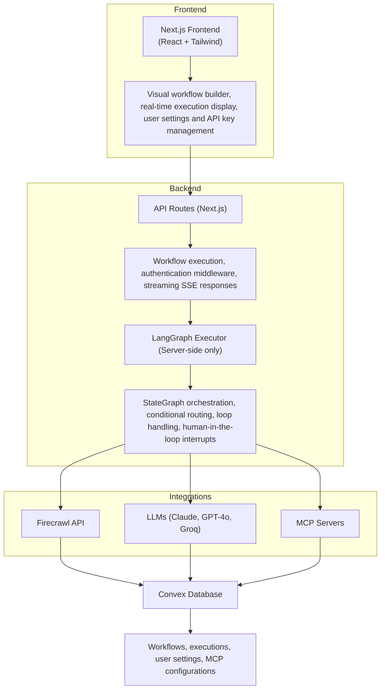

# Open Agent Builder

<p align="center">
  
</p>

<div align="center">

**Enterprise-Grade Visual AI Agent Platform with Multi-Tool Integration**

[](https://choosealicense.com/licenses/mit/)
[](https://nextjs.org/)
[](https://github.com/langchain-ai/langgraph)

[Documentation](#-documentation) • [Examples](#example-workflows) • [Architecture](#architecture)

</div>

---

## What is Open Agent Builder?

**Open Agent Builder** is an enterprise-grade, visual workflow platform for building, deploying, and managing sophisticated AI agent workflows. Originally inspired by Firecrawl's workflow concepts, this project has evolved into a comprehensive agent orchestration platform with extensive tool integrations, multi-LLM support, and production-ready security features.

### Built for Enterprise & Scale

- **Visual No-Code Interface** - Drag-and-drop workflow builder with 15 node types
- **Multi-Tool Integration** - 6+ integrated tools (Firecrawl, Tavily, Serper, E2B, Arcade, Gamma AI)
- **Multi-LLM Support** - Choose from Claude, GPT-4, Gemini, or Groq (all models support tools)
- **Real-Time Execution** - Server-Sent Events (SSE) streaming with live progress updates
- **Enterprise Authentication** - Azure AD integration with automatic token refresh
- **Production Security** - OWASP Top 10 compliance, sandboxed code execution, input validation

**Perfect for:**
- **Enterprise Web Automation** - Complex multi-step scraping and data extraction pipelines
- **AI Research Assistants** - Multi-tool agent workflows with web search, scraping, and analysis
- **Content Generation** - Automated document, presentation, and report creation (Gamma AI integration)
- **Data Processing Pipelines** - Transform, validate, and analyze data with sandboxed code execution
- **Browser Automation** - Form filling, login flows, and JavaScript-heavy site interactions (Arcade)
- **Human-in-the-Loop Workflows** - Approval gates for sensitive operations
- **Custom Tool Integration** - Extensible MCP protocol support for any external service

### Key Differentiators

✨ **Multi-Tool Agent Orchestration** - First visual workflow builder with native support for Firecrawl, Tavily, Serper, E2B, Arcade, and Gamma AI

🔐 **Enterprise Security** - Production-ready with Azure AD SSO, encrypted API keys, SSRF protection, and sandboxed code execution

🎯 **True No-Code** - Build sophisticated agent workflows without writing any code, then deploy instantly

📊 **Real-Time Execution** - Watch your workflows execute in real-time with SSE streaming and detailed logging

🔧 **Developer Friendly** - Full API access, TypeScript SDK, comprehensive documentation, and extensible architecture

> **Development Status:** This is an actively maintained production-ready platform. We welcome contributions, feedback, and feature requests!

---

## Key Features

### 🎨 Visual Workflow Builder
- **Drag-and-drop interface** with 15 node types for complex workflows
- **Real-time execution** with Server-Sent Events (SSE) streaming
- **15 node types**: Start, Agent, MCP, Extract, HTTP, Transform, If/Else, While, Approval, End, Set-State, Guardrails, Arcade, Gamma AI, Note
- **Template library** with pre-built workflows (web scraping, research, price monitoring, etc.)
- **Variable system** with `{{variableName}}` syntax for dynamic data flow
- **Auto-save** with 1-second debounce and automatic edge validation

### 🤖 Multi-Tool Agent Integration
- **6 Integrated Tools**: Firecrawl (web scraping), Tavily (AI search), Serper (Google API), E2B (code execution), Arcade (browser automation), Gamma AI (presentations)
- **MCP Protocol Support** - Extensible Model Context Protocol for custom tool integration
- **Tool Auto-Discovery** - Agents automatically receive tool definitions and invocation rights
- **Two-Tier API Keys** - System-level fallback keys + user-level encrypted keys
- **Universal Tool Support** - All LLM providers (Claude, GPT-4, Gemini, Groq) support all tools

### 🧠 Multi-LLM Support
- **Anthropic Claude** - Haiku 4.5, Sonnet 4.5, Opus 4.5
- **OpenAI** - GPT-4o, GPT-4o-mini
- **Google Gemini** - 2.0 Flash Experimental, 2.0 Flash, 2.0 Flash-Lite
- **Groq** - Llama 3.3 70B, Llama 3.1 8B Instant, GPT OSS 120B/20B
- **All Providers Support Tools + MCP** - Universal tool support across all LLM providers
- **Mix and Match** - Use different models for different nodes in the same workflow

### 🚀 End-User Workflow Execution
- **Workflow Runner UI** - Clean interface for executing published workflows
- **Direct Links** - Share workflows via URL with embedded execution
- **Real-time Progress** - Live updates with node-by-node execution tracking
- **API Access** - Programmatic execution with streaming SSE responses
- **Human-in-the-Loop** - Approval gates for sensitive operations

### 🔐 Enterprise Security & Authentication
- **Azure AD Integration** - Microsoft Entra ID with automatic token refresh (24-hour sessions)
- **OWASP Top 10 Compliance** - Comprehensive protection against web vulnerabilities
- **Sandboxed Code Execution** - E2B Code Interpreter for secure transform nodes
- **Input Validation** - Zod schemas with SSRF protection for HTTP nodes
- **AES-256-GCM Encryption** - User API keys encrypted at rest
- **Rate Limiting** - Distributed rate limits (10 executions/min per user)

### 📊 Production-Ready Infrastructure
- **LangGraph Orchestration** - State management, conditional routing, loops, interrupts
- **Convex Real-Time Database** - Persistent storage with automatic reactivity
- **Next.js 16 + React 19** - Modern full-stack framework with App Router
- **TypeScript** - Type-safe development across the entire stack
- **Vercel Deployment** - One-click deployment with edge functions

---

## Tech Stack

### Core Infrastructure
| Technology | Purpose |
|-----------|---------|
| **[Next.js 16](https://nextjs.org/)** | Full-stack React framework with App Router, API routes, and SSE streaming |
| **[TypeScript](https://www.typescriptlang.org/)** | Type-safe development across the entire stack |
| **[LangGraph](https://github.com/langchain-ai/langgraph)** | Workflow orchestration engine with StateGraph, conditional routing, and interrupts |
| **[Convex](https://convex.dev)** | Real-time database with automatic reactivity and server-side functions |
| **[Azure AD / Entra ID](https://azure.microsoft.com/en-us/services/active-directory/)** | Enterprise authentication with automatic token refresh via NextAuth.js |
| **[Vercel](https://vercel.com)** | Production deployment with edge functions and automatic scaling |

### Frontend & UI
| Technology | Purpose |
|-----------|---------|
| **[React 19](https://react.dev/)** | Modern component-based UI with server components |
| **[Tailwind CSS](https://tailwindcss.com/)** | Utility-first CSS framework for responsive design |
| **[React Flow](https://reactflow.dev/)** | Visual workflow canvas with drag-and-drop node editing |
| **[Framer Motion](https://www.framer.com/motion/)** | Animation library for smooth UI transitions |

### LLM Providers (Choose Any)
| Provider | Models | Tool Support |
|----------|--------|-------------|
| **[Anthropic Claude](https://www.anthropic.com/)** | Haiku 4.5, Sonnet 4.5, Opus 4.5 | ✅ Tools + MCP |
| **[OpenAI](https://platform.openai.com/)** | GPT-4o, GPT-4o-mini | ✅ Tools + MCP |
| **[Google Gemini](https://ai.google.dev/)** | 2.0 Flash Experimental, 2.0 Flash, 2.0 Flash-Lite | ✅ Tools + MCP |
| **[Groq](https://groq.com/)** | Llama 3.3 70B, Llama 3.1 8B Instant | ✅ Tools + MCP |

### Integrated Tools
| Tool | Purpose | Integration |
|------|---------|-------------|
| **[Firecrawl](https://firecrawl.dev)** 🔥 | Web scraping and crawling (scrape, crawl, map, extract) | MCP Protocol |
| **[Tavily](https://tavily.com)** | AI-powered web search with source citations | REST API |
| **[Serper](https://serper.dev)** | Google Search API (web, news, images, places) | REST API |
| **[E2B](https://e2b.dev)** | Sandboxed code execution (Python, JavaScript) | SDK |
| **[Arcade](https://arcade.ai)** | Browser automation and form filling | REST API |
| **[Gamma AI](https://gamma.app)** | AI-powered presentation and document generation | REST API |

### Origins & Attribution

**Open Agent Builder** was originally inspired by **[Firecrawl](https://firecrawl.dev)**'s workflow concepts and has evolved into a comprehensive enterprise platform through extensive development by the Bounteous team.

**What started as:** A Firecrawl-powered workflow builder
**Evolved into:** A multi-tool agent orchestration platform with:
- 6 integrated tools (including Firecrawl as one of many)
- 4 LLM providers with universal tool support
- Enterprise authentication and security
- Production-ready infrastructure
- Extensible architecture for custom tools

**Credit to Firecrawl:** The initial workflow concept and web scraping integration
**Built by Bounteous:** All additional features, security, tools, infrastructure, and production hardening

We remain grateful to the Firecrawl team for the original inspiration, and Firecrawl continues to be a powerful tool within our platform.

---

## Prerequisites

**For Administrators (Initial Setup):**

1. **Node.js 18+** installed on your machine
2. **Convex account** - [Sign up free](https://convex.dev)
3. **Azure AD tenant** - Microsoft 365 or Azure subscription with admin access
4. **System-Level API Keys** (configured once, works for all users):
   - Firecrawl API key - [Get one here](https://firecrawl.dev)
   - At least one LLM provider key (Anthropic Claude, OpenAI, Google Gemini, or Groq)
   - E2B API key for secure code execution - [Get one here](https://e2b.dev)

**For End Users:**

✅ **No API keys required!** The application works out-of-the-box with administrator-configured system keys.

🔧 **Optional:** Users can add their own API keys in Settings → API Keys to override system defaults and use their own quotas.

---

## Installation & Setup
```bash
# Install Convex CLI globally
npm install -g convex

# Initialize Convex project
npx convex dev
```

This will:
- Open your browser to create/link a Convex project
- Generate a `NEXT_PUBLIC_CONVEX_URL` in your `.env.local`
- Start the Convex development server

Keep the Convex dev server running in a separate terminal.

### 3. Set Up Azure AD Authentication

Azure AD (Microsoft Entra ID) provides enterprise-grade authentication.

1. **Register an Application** in Azure Portal:
   - Go to [Azure Portal](https://portal.azure.com) → Azure Active Directory → App registrations
   - Click "New registration"
   - Name: "Open Agent Builder"
   - Supported account types: "Accounts in this organizational directory only"
   - Redirect URI: Web → `http://localhost:3000/api/auth/callback/azure-ad`
   - Click "Register"

2. **Configure the App Registration**:
   - Copy the **Application (client) ID** → This is your `AUTH_MICROSOFT_ID`
   - Copy the **Directory (tenant) ID** → This is your `AUTH_MICROSOFT_TENANT_ID`
   - Go to "Certificates & secrets" → "New client secret"
   - Add description and expiry → Copy the **Value** → This is your `AUTH_MICROSOFT_SECRET`

3. **Add to `.env.local`**:

```bash
# Azure Authentication
AUTH_MICROSOFT_ID=your-application-client-id
AUTH_MICROSOFT_SECRET=your-client-secret-value
AUTH_MICROSOFT_TENANT_ID=your-directory-tenant-id
AUTH_SECRET=$(openssl rand -base64 32)  # Generate a secure secret
```

4. **Set in Convex** (for backend validation):

```bash
npx convex env set AUTH_MICROSOFT_ID "your-application-client-id"
```

### 4. Configure System-Level API Keys (Administrator Setup)

**Two-Tier API Key Architecture:**
- **Tier 1:** System keys (Convex environment) - configured by admin, available to all users
- **Tier 2:** User keys (optional) - users can add their own keys in Settings UI to override system defaults

**Set up system-level keys in Convex** (these work for all users):

```bash
# Required: Web scraping engine
npx convex env set FIRECRAWL_API_KEY "fc-..."

# Required: At least one LLM provider (choose one or more)
npx convex env set ANTHROPIC_API_KEY "sk-ant-..."
npx convex env set OPENAI_API_KEY "sk-..."
npx convex env set GOOGLE_API_KEY "AIza..."
npx convex env set GROQ_API_KEY "gsk_..."

# Required: Secure code execution for Transform nodes
npx convex env set E2B_API_KEY "e2b_..."

# Optional: Additional tool providers
npx convex env set TAVILY_API_KEY "tvly-..."
npx convex env set SERPER_API_KEY "..."
npx convex env set ARCADE_API_KEY "arcade_..."
npx convex env set GAMMA_API_KEY "sk-gamma_..."
```

**Get your API keys:**
- [Firecrawl](https://firecrawl.dev) - Web scraping
- [Anthropic](https://console.anthropic.com) - Claude models
- [OpenAI](https://platform.openai.com) - GPT models
- [Google AI Studio](https://aistudio.google.com) - Gemini models
- [Groq](https://console.groq.com) - Fast inference
- [E2B](https://e2b.dev) - Code sandboxing

> **Why Convex?** Storing keys in Convex environment (not `.env.local`) ensures they work across all deployment environments and are available to all users without individual setup.

### 5. Set Up Security (Required for Production)

**Critical security configurations required before deployment:**

```bash
# Generate encryption key (32 bytes for AES-256-GCM)
node -e "console.log(require('crypto').randomBytes(32).toString('base64'))"

# Set in Convex environment
npx convex env set ENCRYPTION_KEY "<generated-key>"

# Also add to .env.local for local development
ENCRYPTION_KEY=<generated-key>
```

> **Security Note:** The encryption key is used to encrypt user-provided API keys in the database. Users can optionally store their own keys securely via Settings → API Keys.

**Verify security setup:**
```bash
node scripts/verify-security-setup.js
```

For complete security documentation, see [SECURITY.md](./SECURITY.md)

### 8. Optional: HTTP Domain Whitelist

For enhanced security, restrict HTTP nodes to specific domains:

```bash
# Optional: Whitelist allowed domains for HTTP requests
ALLOWED_HTTP_DOMAINS=api.example.com,*.trusted.com
```

If not set, HTTP nodes can make requests to any external domain (internal IPs and metadata endpoints are always blocked).

---

## Running the Application

### Development Mode

```bash
# Terminal 1: Convex dev server
npx convex dev

# Terminal 2: Next.js dev server
npm run dev
```

Or run both with one command:

```bash
npm run dev:all
```

Visit [http://localhost:3000](http://localhost:3000)

### Production Build

```bash
npm run build
npm start
```

---

## Quick Start Guide

### Your First Workflow

1. **Sign Up/Login** at `http://localhost:3000`
2. **Click "New Workflow"** or select a template
3. **Try the "Simple Web Scraper" template:**
   - Pre-configured to scrape any website
   - Uses Firecrawl for extraction
   - AI agent summarizes the content
4. **Attach tools to agents** (optional):
   - Select an Agent node
   - Click "Add Tools" in the node panel
   - Choose from Firecrawl MCP tools or standard tools
5. **Click "Run"** and enter a URL
6. **Watch real-time execution** with streaming updates

> ✅ **No API keys needed!** The application works immediately with administrator-configured system keys.
>
> 🔧 **Optional:** Power users can add their own API keys in Settings → API Keys to use their own quotas and override system defaults.

### End-User Workflow Execution

After building a workflow, share it with end users:

1. **Publish your workflow** - Save and copy the workflow ID
2. **Share the Workflow Runner link**:
   ```
   https://your-domain.com/workflow-runner?workflow=<workflow-id>
   ```
3. **End users can execute** without seeing the builder:
   - Clean, simple input form
   - Real-time execution progress
   - Results display
   - No workflow editing access

**Alternative: User Workflow Interface**
```
https://your-domain.com/ui-user-workflows?workflow=<workflow-id>
```
Provides a more customizable execution interface with embedded workflow visualization.

### Understanding Node Types

| Node Type | Purpose | Example Use | Tool Support |
|-----------|---------|-------------|--------------|
| **Start** | Workflow entry point | Define input variables | N/A |
| **Agent** | AI reasoning with LLMs | Analyze data, make decisions | ✅ MCP + Standard Tools |
| **MCP Tool** | External tool calls | Firecrawl scraping, APIs | N/A |
| **Transform** | Data manipulation | Parse JSON, filter arrays | N/A |
| **Extract** | LLM-powered extraction | Extract structured data with JSON schema | N/A |
| **HTTP** | HTTP API requests | Call REST APIs with custom headers/auth | N/A |
| **If/Else** | Conditional logic | Route based on conditions | N/A |
| **While Loop** | Iteration | Process multiple pages | N/A |
| **User Approval** | Human-in-the-loop | Review before posting | N/A |
| **End** | Workflow completion | Return final output | N/A |

---

## LLM & Tool Support

### Supported LLM Providers

| Provider | Models | Tool Support | Notes |
|----------|--------|-------------|-------|
| **Anthropic Claude** | Haiku 4.5, Sonnet 4.5, Opus 4.5 | ✅ Tools + MCP | All tools supported |
| **OpenAI** | GPT-4o, GPT-4o-mini | ✅ Tools + MCP | All tools supported |
| **Google Gemini** | 2.0 Flash Experimental, 2.0 Flash, 2.0 Flash-Lite | ✅ Tools + MCP | All tools supported |
| **Groq** | Llama 3.3 70B, Llama 3.1 8B Instant, GPT OSS 120B/20B | ✅ Tools + MCP | All tools supported |

**Universal Tool Support**: All LLM providers support both standard tools and MCP protocol. The tool integration is handled at the LangGraph orchestration layer, making it provider-agnostic.

### Tool Integration with Agents

**Agent nodes can use two types of tools:**

#### 1. MCP Tools (Model Context Protocol)
MCP tools enable agents to interact with external services:

- **Firecrawl** (built-in): `scrape`, `search`, `crawl`
- **Custom MCP servers**: Add your own via Settings → MCP Registry

**How to use:**
1. Add an **Agent** node to your workflow
2. In the node settings, click **"Add Tools"**
3. Select **MCP Tools** tab
4. Choose **Firecrawl** or custom MCP servers
5. The agent autonomously decides when to use tools

#### 2. Standard Tools
Pre-built tools for common operations:

- **Web Search** - Search the web and get results
- **Calculator** - Perform mathematical calculations
- **Date/Time** - Get current date/time information
- **More coming soon...**

**How to use:**
1. Add an **Agent** node to your workflow
2. In the node settings, click **"Add Tools"**
3. Select **Standard Tools** tab
4. Choose tools to attach
5. Agent can call these tools as needed

**Example workflow with tools:**
```
Start → Agent (with Firecrawl MCP + Calculator) → End
```

The agent can intelligently:
- Scrape websites when it needs data
- Search the web for information
- Calculate numbers when needed
- Combine multiple tool calls to complete tasks

---

## Example Workflows

### 1. Simple Web Scraper
**What it does:** Scrape any website and get an AI summary

**Nodes:** Start → Firecrawl Scrape → Agent Summary → End

**Try it:**
```bash
Input: https://firecrawl.dev
Output: "Firecrawl is a web scraping API that converts websites into LLM-ready markdown..."
```

### 2. Multi-Page Research
**What it does:** Search web, scrape top results, synthesize findings

**Nodes:** Start → Firecrawl Search → Loop (Scrape Each) → Agent Synthesis → End

### 3. Competitive Analysis
**What it does:** Research companies, extract structured data, generate report

**Nodes:** Start → Parse Companies → Loop (Research + Extract) → Approval → Export → End

**Features used:**
- Firecrawl web search
- Structured JSON extraction
- While loops for iteration
- Human approval gates
- Conditional routing

### 4. Price Monitoring
**What it does:** Track product prices across multiple sites

**Nodes:** Start → Loop (Scrape + Extract Price) → Compare → Notify → End

---

## Configuration

### User-Level API Keys

Users can add their own API keys via **Settings → API Keys**:

- **LLM Providers:** Anthropic, OpenAI, Google Gemini, Groq (all support Tools + MCP)
- **Firecrawl:** Personal API key (Optional - falls back to environment variable)
- **Custom MCP Servers:** Authentication tokens

This allows:
- Each user to use their own API quotas
- Fallback to environment variables if not set
- Easy key rotation and management

### MCP Server Registry

Add custom MCP servers in **Settings → MCP Registry**:

1. Click "Add MCP Server"
2. Enter server URL and authentication
3. Test connection to discover available tools
4. Use in Agent nodes by selecting from MCP tools dropdown

**Supported MCP Servers:**
- Firecrawl (built-in)
- Custom HTTP endpoints
- Environment variable substitution: `{API_KEY}`

---

## Deployment

### Deploying to Vercel

1. **Push your code to GitHub**

2. **Deploy to Vercel:**
   ```bash
   # Install Vercel CLI
   npm i -g vercel
   
   # Deploy
   vercel
   ```

3. **Set environment variables** in Vercel dashboard:
   - `NEXT_PUBLIC_CONVEX_URL` (from Convex)
   - Azure AD authentication keys (from Azure Portal)
   - `FIRECRAWL_API_KEY` (Required)
   - Optional: Default LLM provider keys

4. **Deploy Convex to production:**
   ```bash
   npx convex deploy
   ```

5. **Update Azure AD settings:**
   - Add your Vercel domain as a redirect URI in Azure Portal
   - Update App Registration authentication settings

### Environment Variables Checklist

**Required:**
- `NEXT_PUBLIC_CONVEX_URL` - Convex database
- `CONVEX_DEPLOYMENT` - Convex deployment ID
- `NEXTAUTH_URL` - Your application URL
- `AUTH_MICROSOFT_ID` - Azure AD Application (client) ID
- `AUTH_MICROSOFT_SECRET` - Azure AD Client secret
- `AUTH_MICROSOFT_TENANT_ID` - Azure AD Directory (tenant) ID
- `AUTH_SECRET` - NextAuth session secret (32-byte random string)
- `FIRECRAWL_API_KEY` - Web scraping
- `ENCRYPTION_KEY` - AES-256 encryption for user API keys (32 bytes base64)
- `E2B_API_KEY` - Secure sandboxed code execution (REQUIRED for transform nodes)

**Optional (can be added in UI instead):**
- `ANTHROPIC_API_KEY` - Claude provider (all models support Tools + MCP)
- `OPENAI_API_KEY` - GPT-4o provider (all models support Tools + MCP)
- `GOOGLE_API_KEY` - Gemini provider (all models support Tools + MCP)
- `GROQ_API_KEY` - Groq provider (all models support Tools + MCP)
- `ALLOWED_HTTP_DOMAINS` - Whitelist for HTTP node requests (security)

---

## Security

Open Agent Builder implements enterprise-grade security measures with comprehensive protection against common web vulnerabilities.

### 🔐 Security Features

**Code Injection Protection:**
- ✅ **No Function() Constructor** - All dynamic code evaluation uses sandboxed environments
- ✅ **E2B Sandbox** - Transform nodes execute in isolated E2B Code Interpreter
- ✅ **mathjs Evaluator** - Safe expression evaluation for conditions (replaces vulnerable expr-eval)
- ✅ **Prototype Pollution Protection** - Clean scopes with `Object.create(null)`

**Input Validation & SSRF Protection:**
- ✅ **Zod Validation** - All API inputs validated with comprehensive schemas
- ✅ **Length Limits** - Maximum sizes to prevent DoS attacks
- ✅ **SSRF Protection** - HTTP nodes blocked from accessing private IPs (127.0.0.1, 10.x, 192.168.x, localhost)
- ✅ **Format Validation** - Regex patterns for IDs, URLs, and user input

**XSS & Output Security:**
- ✅ **DOMPurify** - HTML sanitization in workflow results display
- ✅ **Tag Whitelist** - Only safe HTML tags allowed in output
- ✅ **Attribute Filter** - Script handlers and dangerous attributes removed

**Authentication & Authorization:**
- ✅ **Ownership Checks** - Users can only modify their own workflows/MCP servers
- ✅ **JWT Authentication** - Azure AD authentication via NextAuth.js for all protected routes
- ✅ **API Key Authentication** - Optional API key auth for programmatic access
- ✅ **AES-256-GCM Encryption** - User API keys encrypted at rest

**Network Security:**
- ✅ **CORS Configuration** - Environment-specific origin whitelist (no wildcards)
- ✅ **Distributed Rate Limiting** - Convex-based (10 workflow executions/min per user)
- ✅ **Secure Random Generation** - Cryptographically secure API key generation

**Dependency Security:**
- ✅ **Regular Audits** - Automated npm audit checks
- ✅ **Secure Libraries** - Vulnerable packages replaced (expr-eval removed)
- ✅ **Up-to-date Dependencies** - Critical security patches applied

### 📋 Security Checklist

Before deploying to production:

- [x] Set `ENCRYPTION_KEY` (32-byte base64) in Convex environment
- [x] Set `E2B_API_KEY` (required for transform nodes) in Convex environment
- [x] Review `.env.local` - should only contain Next.js config (no API keys)
- [x] All API keys stored in Convex environment variables
- [ ] Enable HTTPS only (disable HTTP)
- [ ] Configure Content Security Policy headers
- [ ] Set up monitoring and alerts
- [ ] Review rate limit configurations
- [ ] Optional: Configure `ALLOWED_HTTP_DOMAINS` whitelist

### 🔍 Security Status

**Latest Security Audit:** December 3, 2025

- ✅ **15/15 vulnerabilities fixed** (8 CRITICAL, 5 HIGH, 2 MEDIUM)
- ✅ **0 exploitable vulnerabilities** remaining
- ⚠️ **3 low-risk known issues** (html-docx-js dependencies - isolated to Word export)

**Run security audit:**
```bash
# Check for vulnerabilities
npm audit

# Apply automatic fixes
npm audit fix

# View comprehensive security report
cat docs/SECURITY-FIXES-REPORT.md
```

### 📚 Security Documentation

**Complete Documentation:**
- **[docs/SECURITY-FIXES-REPORT.md](./docs/SECURITY-FIXES-REPORT.md)** - Comprehensive security audit and fixes (Dec 2025)
- **[CLEANUP-SUMMARY.md](./CLEANUP-SUMMARY.md)** - API key migration to Convex
- **[lib/api/validation-schemas.ts](./lib/api/validation-schemas.ts)** - Input validation schemas
- **[CLAUDE.md](./CLAUDE.md)** - Security architecture and best practices

**OWASP Top 10 (2021) Coverage:**
- ✅ A01:2021 - Broken Access Control
- ✅ A03:2021 - Injection
- ✅ A05:2021 - Security Misconfiguration
- ✅ A06:2021 - Vulnerable and Outdated Components
- ✅ A07:2021 - Cross-Site Scripting (XSS)

### 🚨 Reporting Security Issues

If you discover a security vulnerability, please report it via GitHub Security Advisories instead of opening a public issue.

---

## 📚 Documentation

> **📑 Full Documentation Index**: See **[DOCUMENTATION-INDEX.md](./DOCUMENTATION-INDEX.md)** for complete documentation catalog

### Quick Start

| I want to... | Read this document |
|--------------|-------------------|
| **Get started quickly** | This README (you are here) |
| **Learn how to use the app** | [docs/USER-GUIDE.md](./docs/USER-GUIDE.md) 📖 |
| **Install and configure** | [docs/ADMIN-GUIDE.md](./docs/ADMIN-GUIDE.md) 🔧 |
| **Understand the architecture** | [docs/ARCHITECTURE.md](./docs/ARCHITECTURE.md) ⭐ |
| **Develop or contribute** | [CLAUDE.md](./CLAUDE.md) 💻 |
| **Deploy to production** | [DEPLOYMENT.md](./DEPLOYMENT.md) 🚀 |
| **Add new tools** | [ADDING-NEW-TOOLS.md](./ADDING-NEW-TOOLS.md) 🔧 |
| **Understand security** | [SECURITY.md](./SECURITY.md) 🔐 |

### Core Documentation

**For Users:**
- **[User Guide](./docs/USER-GUIDE.md)** 📖 - Complete user documentation (500+ lines)
- **[Workflow Runner](./docs/guides/WORKFLOW-RUNNER-README.md)** - End-user execution interface

**For Administrators:**
- **[Admin Guide](./docs/ADMIN-GUIDE.md)** 🔧 - Installation, configuration, deployment (900+ lines)
- **[Deployment Guide](./DEPLOYMENT.md)** 🚀 - Production deployment instructions
- **[Environment Switching](./ENVIRONMENT-SWITCHING.md)** 🔄 - Switch between dev/prod

**For Developers:**
- **[Developer Guide (CLAUDE.md)](./CLAUDE.md)** 💻 - Development setup and patterns (500+ lines)
- **[Architecture Guide](./docs/ARCHITECTURE.md)** ⭐ - System architecture deep dive (1200+ lines)
- **[Adding New Tools](./ADDING-NEW-TOOLS.md)** 🔧 - Tool integration guide
- **[Contributing Guide](./CONTRIBUTING.md)** 🤝 - How to contribute

**Security & Operations:**
- **[Security Guide](./SECURITY.md)** 🔐 - Security features and best practices
- **[Security Audit Report](./docs/SECURITY-FIXES-REPORT.md)** 🛡️ - December 2025 audit results

### Specialized Guides

**UI Builder** (4 guides in `docs/guides/`):
- Complete UI Builder documentation
- 5-minute quickstart tutorial
- Architecture diagrams and examples

**Additional Resources:**
- [Vercel Deployment Guide](./docs/guides/VERCEL_DEPLOYMENT_GUIDE.md)
- [Architecture Documentation](./docs/architecture/) - Database schema, execution engine
- [Historical Documentation](./docs/archive/) - Archived summaries and logs

---

## API Usage

### Programmatic Execution

Generate an API key in **Settings → API Keys**, then:

```bash
curl -X POST https://your-domain.com/api/workflows/my-workflow-id/execute-stream \
  -H "Authorization: Bearer sk_live_..." \
  -H "Content-Type: application/json" \
  -d '{"url": "https://example.com"}'
```

**Response:** Server-Sent Events (SSE) stream with real-time updates

## Architecture



---


## Project Status & Roadmap

### In Progress
- **MCP Support for OpenAI & Groq** - Adding native MCP protocol support
- **OAuth MCP Authentication** - Support for OAuth-based MCP servers
- **Additional MCP Integrations** - More pre-built MCP server connections
- **Workflow Sharing** - Public template marketplace
- **Scheduled Executions** - Cron-based workflow triggers

### Partial Support
- **E2B Code Interpreter** - Transform node sandboxing (requires E2B API key)
- **Complex Loop Patterns** - Nested loops and advanced iteration
- **Custom Node Types** - Plugin system for community nodes

### Coming Soon
- OAuth authentication for MCP servers
- Parallel tool execution for agents
- Workflow versioning and rollback
- Custom plugin system for community nodes

We welcome contributions and PRs to help build these features!

## License

This project is licensed under the MIT License.

---

<div align="center">

## 🙏 Acknowledgments

**Originally Inspired by** [Firecrawl](https://firecrawl.dev) 🔥
**Developed & Maintained by** [Bounteous](https://www.bounteous.com) 💙

---

### Built With

❤️ **Open Source** | 🚀 **Production-Ready** | 🔐 **Enterprise-Grade**

---

**[⭐ Star us on GitHub](#)** | **[📖 Read the Docs](#-documentation)** | **[🚀 Try Firecrawl](https://firecrawl.dev)**

### Contributing

We welcome contributions! This project has grown from a simple workflow builder into a comprehensive agent platform. Whether you're fixing bugs, adding features, or improving documentation, we'd love your help.

**Ways to contribute:**
- 🐛 Report bugs and issues
- 💡 Suggest new features or tools
- 📝 Improve documentation
- 🔧 Submit pull requests
- ⭐ Star the repository

---

Built with ❤️ by the **Bounteous** team
Original workflow concept inspired by **Firecrawl**

</div>
