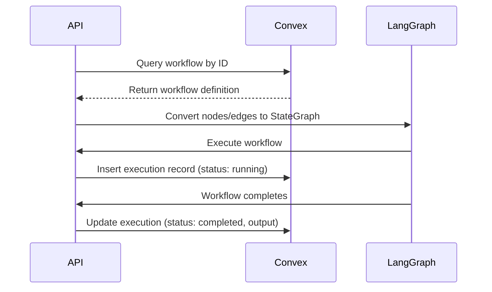
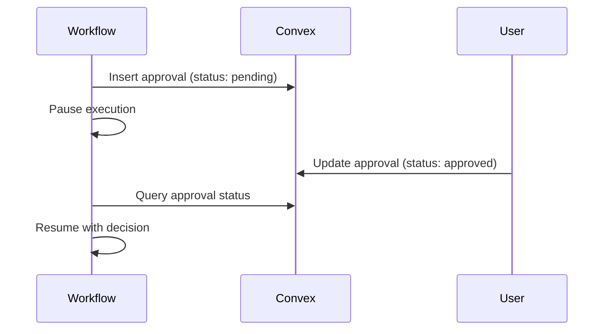

# Database Schema

This document describes the complete Convex database schema for Open Agent Builder.

## Overview

Open Agent Builder uses [Convex](https://convex.dev) as its real-time database. The schema defines 13 tables for managing workflows, executions, user data, and system operations.

## Table Definitions

### 1. users

Stores user profile information synced from Azure AD (Microsoft Entra ID) authentication.

```typescript
users: defineTable({
  name: v.string(),
  email: v.string(),
  clerkId: v.string(),
  imageUrl: v.optional(v.string()),
  createdAt: v.number(),
  updatedAt: v.number(),
})
  .index("by_clerk_id", ["clerkId"])
  .index("by_email", ["email"])
```

**Indexes:**
- `by_clerk_id` - Fast lookup by user identity ID
- `by_email` - Fast lookup by email address

---

### 2. workflows

Stores workflow definitions (nodes and edges).

```typescript
workflows: defineTable({
  name: v.string(),
  description: v.optional(v.string()),
  nodes: v.array(v.any()),
  edges: v.array(v.any()),
  userId: v.string(),
  createdAt: v.number(),
  updatedAt: v.number(),
  templateId: v.optional(v.string()),
})
  .index("by_user", ["userId"])
  .index("by_template", ["templateId"])
```

**Fields:**
- `nodes` - Array of workflow nodes (React Flow format)
- `edges` - Array of connections between nodes
- `userId` - Owner of the workflow
- `templateId` - Optional template this workflow was created from

**Indexes:**
- `by_user` - List all workflows for a user
- `by_template` - Find workflows created from template

---

### 3. executions

Stores workflow execution state and results.

```typescript
executions: defineTable({
  workflowId: v.id("workflows"),
  userId: v.string(),
  status: v.union(
    v.literal("running"),
    v.literal("completed"),
    v.literal("failed"),
    v.literal("pending_approval")
  ),
  input: v.optional(v.any()),
  output: v.optional(v.any()),
  error: v.optional(v.string()),
  startedAt: v.number(),
  completedAt: v.optional(v.number()),
  nodeResults: v.optional(v.any()),
})
  .index("by_workflow", ["workflowId"])
  .index("by_user", ["userId"])
  .index("by_status", ["status"])
```

**Status Values:**
- `running` - Execution in progress
- `completed` - Finished successfully
- `failed` - Error occurred
- `pending_approval` - Waiting for human approval

**Fields:**
- `nodeResults` - Map of node results for debugging

**Indexes:**
- `by_workflow` - All executions for a workflow
- `by_user` - All executions by a user
- `by_status` - Filter by status

---

### 4. mcpServers

Global registry of MCP (Model Context Protocol) servers.

```typescript
mcpServers: defineTable({
  name: v.string(),
  description: v.string(),
  type: v.union(v.literal("stdio"), v.literal("sse")),
  command: v.optional(v.string()),
  args: v.optional(v.array(v.string())),
  url: v.optional(v.string()),
  env: v.optional(v.any()),
  createdAt: v.number(),
  updatedAt: v.number(),
})
  .index("by_name", ["name"])
```

**Types:**
- `stdio` - Command-line MCP server (local)
- `sse` - Server-Sent Events MCP server (remote)

**Example:**
```json
{
  "name": "firecrawl",
  "type": "sse",
  "url": "https://mcp.firecrawl.dev/sse"
}
```

---

### 5. userMCPs

User-specific MCP server configurations.

```typescript
userMCPs: defineTable({
  userId: v.string(),
  mcpServerId: v.id("mcpServers"),
  name: v.string(),
  config: v.optional(v.any()),
  enabled: v.boolean(),
  createdAt: v.number(),
  updatedAt: v.number(),
})
  .index("by_user", ["userId"])
  .index("by_mcp_server", ["mcpServerId"])
```

**Fields:**
- `config` - User-specific configuration (API keys, etc.)
- `enabled` - Whether this MCP is active for user

---

### 6. apiKeys

User-generated API keys for programmatic workflow execution.

```typescript
apiKeys: defineTable({
  userId: v.string(),
  name: v.string(),
  key: v.string(),
  hashedKey: v.string(),
  lastUsedAt: v.optional(v.number()),
  createdAt: v.number(),
  expiresAt: v.optional(v.number()),
})
  .index("by_user", ["userId"])
  .index("by_hashed_key", ["hashedKey"])
```

**Security:**
- `key` - Full key shown ONCE on creation
- `hashedKey` - SHA-256 hash for verification
- Keys are never logged or displayed after creation

---

### 7. userLLMKeys

User-provided LLM API keys (encrypted).

```typescript
userLLMKeys: defineTable({
  userId: v.string(),
  provider: v.union(
    v.literal("anthropic"),
    v.literal("openai"),
    v.literal("groq"),
    v.literal("google")
  ),
  encryptedKey: v.string(),
  iv: v.string(),
  createdAt: v.number(),
  updatedAt: v.number(),
})
  .index("by_user_and_provider", ["userId", "provider"])
```

**Encryption:**
- AES-256-GCM encryption using `ENCRYPTION_KEY` environment variable
- Each key has unique IV (initialization vector)
- See `convex/lib/encryption.ts` for implementation

---

### 8. userToolKeys

User API keys for external tools (Firecrawl, E2B, Arcade).

```typescript
userToolKeys: defineTable({
  userId: v.string(),
  tool: v.union(
    v.literal("firecrawl"),
    v.literal("e2b"),
    v.literal("arcade")
  ),
  encryptedKey: v.string(),
  iv: v.string(),
  createdAt: v.number(),
  updatedAt: v.number(),
})
  .index("by_user_and_tool", ["userId", "tool"])
```

**Similar to userLLMKeys:**
- AES-256-GCM encryption
- Unique IV per key

---

### 9. approvals

Human-in-the-loop approval records.

```typescript
approvals: defineTable({
  executionId: v.id("executions"),
  workflowId: v.id("workflows"),
  userId: v.string(),
  nodeId: v.string(),
  status: v.union(
    v.literal("pending"),
    v.literal("approved"),
    v.literal("rejected")
  ),
  data: v.any(),
  decision: v.optional(v.any()),
  createdAt: v.number(),
  decidedAt: v.optional(v.number()),
})
  .index("by_execution", ["executionId"])
  .index("by_user", ["userId"])
  .index("by_status", ["status"])
```

**Workflow:**
1. Workflow reaches `user-approval` node
2. Approval record created with `status: "pending"`
3. User reviews and approves/rejects
4. Workflow resumes with decision

---

### 10. rateLimits

Distributed rate limiting across serverless instances.

```typescript
rateLimits: defineTable({
  key: v.string(),
  requests: v.array(v.number()),
  resetAt: v.number(),
  createdAt: v.number(),
  updatedAt: v.number(),
})
  .index("by_key", ["key"])
  .index("by_resetAt", ["resetAt"])
```

**Algorithm:**
- Sliding window rate limiting
- `requests` - Array of request timestamps
- `key` format: `user:{userId}:{action}`

**Example:**
```typescript
{
  key: "user:123:workflow-execution",
  requests: [1732419600000, 1732419605000, ...],
  resetAt: 1732419660000
}
```

---

### 11. cache

Distributed caching across serverless instances.

```typescript
cache: defineTable({
  key: v.string(),
  value: v.string(),
  expiresAt: v.number(),
  createdAt: v.number(),
})
  .index("by_key", ["key"])
  .index("by_expiration", ["expiresAt"])
```

**Features:**
- JSON-serialized values
- Automatic expiration
- Cron job cleanup every 5 minutes

---

### 12. arcadeAuth

Arcade authentication state management.

```typescript
arcadeAuth: defineTable({
  userId: v.string(),
  authUrl: v.string(),
  status: v.union(
    v.literal("pending"),
    v.literal("completed"),
    v.literal("failed")
  ),
  createdAt: v.number(),
  expiresAt: v.number(),
})
  .index("by_user", ["userId"])
```

---

### 13. uiBuilderConfigurations

UI Builder canvas state.

```typescript
uiBuilderConfigurations: defineTable({
  userId: v.string(),
  configurationName: v.string(),
  components: v.array(v.any()),
  workflowId: v.optional(v.id("workflows")),
  createdAt: v.number(),
  updatedAt: v.number(),
})
  .index("by_user", ["userId"])
```

**Fields:**
- `components` - Array of dropped UI components
- `workflowId` - Workflow linked to this UI

---

## Security Considerations

### Encrypted Fields

The following tables store encrypted data:

| Table | Encrypted Fields | Algorithm |
|-------|------------------|-----------|
| `userLLMKeys` | `encryptedKey` | AES-256-GCM |
| `userToolKeys` | `encryptedKey` | AES-256-GCM |

**Required Environment Variable:**
```bash
ENCRYPTION_KEY=<32-byte-base64-key>
```

Generate with:
```bash
node -e "console.log(require('crypto').randomBytes(32).toString('base64'))"
```

### Authorization

All Convex functions use `getUserId()` to ensure users can only:
- Read their own data
- Modify their own resources
- Access their own API keys

**Example:**
```typescript
const userId = await getUserId(ctx);
if (!userId) throw new Error("Unauthorized");

const workflow = await ctx.db.get(workflowId);
if (workflow.userId !== userId) throw new Error("Forbidden");
```

---

## Indexes

Indexes are critical for query performance. Current index strategy:

| Pattern | Index | Purpose |
|---------|-------|---------|
| List by owner | `by_user` | User dashboard queries |
| Single lookup | `by_key`, `by_name` | Fast single-record queries |
| Status filtering | `by_status` | Filter running/completed executions |
| Time-based cleanup | `by_expiration`, `by_resetAt` | Cron job efficiency |

---

## Data Flow Examples

### Workflow Execution



### User-Approval Flow



---

## Maintenance

### Automated Cleanup

**Cache Cleanup:**
```typescript
// Runs every 5 minutes
cron("cleanup-expired-cache", { minutes: 5 }, async () => {
  // Delete records where expiresAt <= now
});
```

**Rate Limit Cleanup:**
```typescript
// Could be added - delete old rate limit records
cron("cleanup-old-rate-limits", { hours: 1 }, async () => {
  // Delete records where resetAt < now - 1 hour
});
```

### Manual Cleanup

```bash
# View database in Convex dashboard
npx convex dashboard

# Export all data
npx convex export

# Clear specific table (DANGEROUS)
npx convex run clearTable --table executions
```

---

## Schema Evolution

### Adding a New Field

```typescript
// In convex/schema.ts
workflows: defineTable({
  // ... existing fields
  tags: v.optional(v.array(v.string())), // NEW
})
```

Deploy:
```bash
npx convex deploy
```

Convex automatically handles schema migrations - existing records get `undefined` for new optional fields.

### Adding a New Index

```typescript
workflows: defineTable({ ... })
  .index("by_tags", ["tags"]) // NEW
```

Deploy:
```bash
npx convex deploy
```

Convex builds indexes in background - no downtime.

---

## Performance Tuning

### Query Optimization

**✅ Good:**
```typescript
// Uses index
const workflow = await ctx.db
  .query("workflows")
  .withIndex("by_user", q => q.eq("userId", userId))
  .first();
```

**❌ Bad:**
```typescript
// No index - full table scan
const workflows = await ctx.db.query("workflows").collect();
const filtered = workflows.filter(w => w.userId === userId);
```

### Pagination

```typescript
const page = await ctx.db
  .query("executions")
  .withIndex("by_user", q => q.eq("userId", userId))
  .order("desc")
  .paginate({ cursor, numItems: 20 });
```

---

## Related Documentation

- [Convex Schema Reference](https://docs.convex.dev/database/schemas)
- [ARCHITECTURE.md](../architecture/README.md) - System architecture
- [SECURITY.md](../security/README.md) - Security features
- [CLAUDE.md](../../CLAUDE.md) - Developer guide
