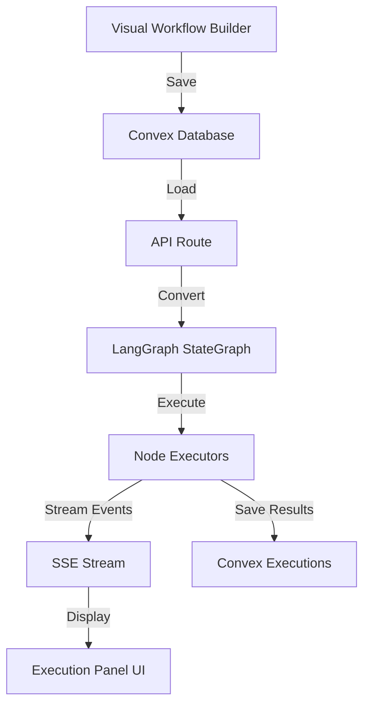
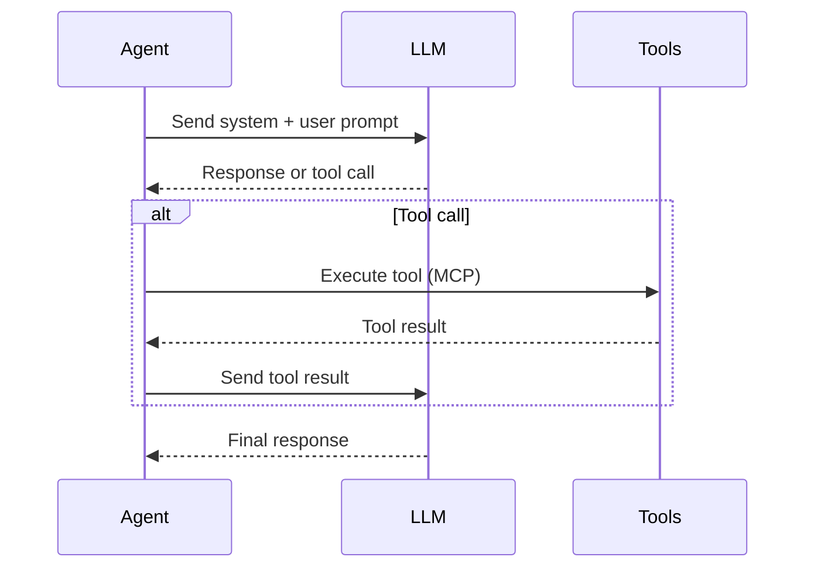
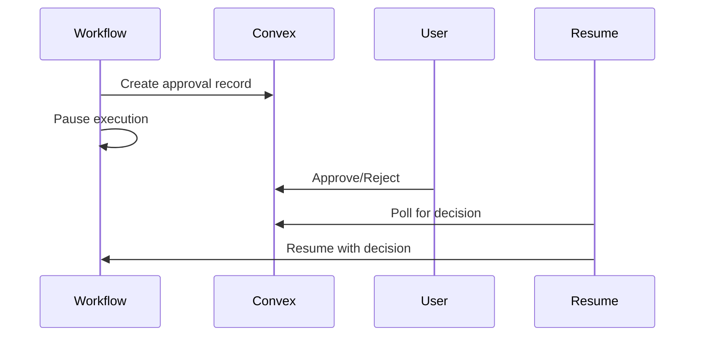

# Workflow Execution Engine

This document explains how workflows are executed in Open Agent Builder, from workflow definition to completion.

## Overview

Open Agent Builder uses [LangGraph](https://langchain-ai.github.io/langgraph/) as its workflow orchestration engine. Workflows defined visually in React Flow are converted to LangGraph StateGraphs for execution.

## Architecture Diagram



## Execution Flow

### 1. Workflow Definition

Users create workflows in the visual builder ([WorkflowBuilder.tsx](../../components/app/(home)/sections/workflow-builder/WorkflowBuilder.tsx)):

```typescript
// Workflow stored in Convex
{
  id: "wf_123",
  name: "Web Scraper",
  nodes: [
    { id: "start", type: "start", data: { variables: ["url"] } },
    { id: "scrape", type: "mcp", data: { tool: "firecrawl_scrape" } },
    { id: "end", type: "end" }
  ],
  edges: [
    { source: "start", target: "scrape" },
    { source: "scrape", target: "end" }
  ]
}
```

### 2. Execution Request

**HTTP Endpoints:**

| Endpoint | Method | Purpose |
|----------|--------|---------|
| `/api/workflows/[id]/execute` | POST | Standard execution (JSON response) |
| `/api/workflows/[id]/execute-stream` | POST | Streaming execution (SSE) |
| `/api/workflows/[id]/resume` | POST | Resume after approval |

**Request:**
```bash
POST /api/workflows/wf_123/execute-stream
Content-Type: application/json
Authorization: Bearer <api-key-or-session>

{
  "input": {
    "url": "https://example.com"
  }
}
```

### 3. LangGraph Conversion

The [LangGraphExecutor](../../lib/workflow/langgraph.ts) converts workflows to StateGraphs:

```typescript
class LangGraphExecutor {
  async execute(workflow, input, stream) {
    // 1. Create StateGraph with workflow state annotation
    const graph = new StateGraph(WorkflowStateAnnotation);

    // 2. Add nodes for each workflow node
    for (const node of workflow.nodes) {
      graph.addNode(node.id, createNodeFunction(node));
    }

    // 3. Add edges for routing
    for (const edge of workflow.edges) {
      graph.addEdge(edge.source, edge.target);
    }

    // 4. Set entry point
    graph.addEdge(START, startNode.id);

    // 5. Compile and execute
    const compiledGraph = graph.compile();
    const result = await compiledGraph.invoke({ variables: input });

    return result;
  }
}
```

### 4. State Management

LangGraph manages workflow state using the `WorkflowStateAnnotation`:

```typescript
const WorkflowStateAnnotation = Annotation.Root({
  // Variable storage (shared across nodes)
  variables: Annotation<Record<string, any>>({
    reducer: (prev, update) => ({ ...prev, ...update }),
  }),

  // Node execution results
  nodeResults: Annotation<Record<string, any>>({
    reducer: (prev, update) => ({ ...prev, ...update }),
  }),

  // Error tracking
  errors: Annotation<Array<{ nodeId: string; error: string }>>({
    reducer: (prev, update) => [...prev, ...update],
    default: () => [],
  }),

  // Current node ID
  currentNodeId: Annotation<string>({
    reducer: (_, update) => update,
    default: () => "",
  }),
});
```

**Key Concepts:**

- **Variables:** Shared data accessible to all nodes
- **Reducers:** Immutable state updates (never mutate directly)
- **Default Values:** Initial state for new executions

### 5. Node Execution

Each node type has a dedicated executor in `lib/workflow/executors/`:

| Node Type | Executor | Purpose |
|-----------|----------|---------|
| `start` | Built-in | Entry point with input variables |
| `agent` | [agent.ts](../../lib/workflow/executors/agent.ts) | AI agent with LLM |
| `mcp` | [mcp.ts](../../lib/workflow/executors/mcp.ts) | MCP tool calls |
| `extract` | [extract.ts](../../lib/workflow/executors/extract.ts) | LLM extraction |
| `http` | [http.ts](../../lib/workflow/executors/http.ts) | HTTP requests |
| `transform` | [data.ts](../../lib/workflow/executors/data.ts) | Data manipulation |
| `if-else` | [logic.ts](../../lib/workflow/executors/logic.ts) | Conditional routing |
| `while` | [logic.ts](../../lib/workflow/executors/logic.ts) | Loop iteration |
| `user-approval` | Built-in | Human-in-the-loop |
| `end` | Built-in | Terminal node |

**Executor Interface:**

```typescript
export async function executeNode(
  node: WorkflowNode,
  state: typeof WorkflowStateAnnotation.State,
  apiKeys?: { anthropic?: string; openai?: string; groq?: string }
): Promise<NodeExecutionResult> {
  return {
    success: true,
    output: { ... },
    variables: { newVar: "value" },
    error: null,
  };
}
```

### 6. Streaming Events (SSE)

Execution progress streams via Server-Sent Events:

**Event Types:**

```typescript
type StreamEvent =
  | { event: "workflow_started"; data: { workflowId: string } }
  | { event: "node_started"; data: { nodeId: string; nodeName: string } }
  | { event: "node_completed"; data: { nodeId: string; output: any } }
  | { event: "node_failed"; data: { nodeId: string; error: string } }
  | { event: "workflow_completed"; data: { output: any } }
  | { event: "error"; data: { message: string } };
```

**Example Stream:**

```
event: workflow_started
data: {"workflowId":"wf_123"}

event: node_started
data: {"nodeId":"start","nodeName":"Start"}

event: node_completed
data: {"nodeId":"start","output":{"url":"https://example.com"}}

event: node_started
data: {"nodeId":"scrape","nodeName":"Scrape Website"}

event: node_completed
data: {"nodeId":"scrape","output":{"html":"<html>...","markdown":"# Title..."}}

event: workflow_completed
data: {"output":{"markdown":"# Title..."}}
```

**Client-Side Consumption:**

```typescript
const eventSource = new EventSource('/api/workflows/wf_123/execute-stream');

eventSource.addEventListener('node_completed', (e) => {
  const data = JSON.parse(e.data);
  console.log(`Node ${data.nodeId} completed:`, data.output);
});

eventSource.addEventListener('workflow_completed', (e) => {
  const data = JSON.parse(e.data);
  console.log('Workflow completed:', data.output);
  eventSource.close();
});
```

### 7. Results Storage

Final execution state saved to Convex:

```typescript
await convex.insert("executions", {
  workflowId: "wf_123",
  userId: "user_456",
  status: "completed",
  input: { url: "https://example.com" },
  output: { markdown: "# Title..." },
  startedAt: 1732419600000,
  completedAt: 1732419605000,
  nodeResults: {
    start: { url: "https://example.com" },
    scrape: { html: "...", markdown: "..." },
  },
});
```

---

## Node Executor Deep Dive

### Agent Node

Executes AI agents with LLM reasoning and tool use.

**Configuration:**
```typescript
{
  type: "agent",
  data: {
    model: "claude-sonnet-4-5",
    provider: "anthropic",
    systemPrompt: "You are a helpful assistant",
    userPrompt: "Analyze {{variable}}",
    tools: ["firecrawl_scrape", "calculator"],
    maxIterations: 10
  }
}
```

**Execution Flow:**


**Supported Providers (All support MCP & tools):**
- **Anthropic:** Claude Haiku 4.5, Sonnet 4.5, Opus 4.6 (1M context)
- **OpenAI:** GPT-5.2, GPT-4.5, o3 (advanced reasoning)
- **Google:** Gemini 3 Pro Preview, Gemini 3 Flash, Gemini 2.5 Pro, Gemini 2.5 Flash
- **Groq:** Llama 4 Maverick, Llama 4 Scout, Llama 3.3 70B, Llama 3.1 8B Instant

### MCP Node

Calls Model Context Protocol tools (e.g., Firecrawl).

**Configuration:**
```typescript
{
  type: "mcp",
  data: {
    toolName: "firecrawl_scrape",
    arguments: {
      url: "{{url}}",
      formats: ["markdown", "html"]
    }
  }
}
```

**Tool Resolution:**
```typescript
// 1. Resolve MCP server
const mcpServer = await mcpResolver.resolve("firecrawl");

// 2. Get available tools
const tools = await mcpServer.listTools();

// 3. Call tool
const result = await mcpServer.callTool("firecrawl_scrape", {
  url: "https://example.com",
  formats: ["markdown"]
});
```

### Extract Node

LLM-powered structured data extraction.

**Configuration:**
```typescript
{
  type: "extract",
  data: {
    model: "gpt-4o-mini",
    inputVariable: "html",
    schema: {
      type: "object",
      properties: {
        title: { type: "string" },
        price: { type: "number" },
        availability: { type: "boolean" }
      }
    },
    outputVariable: "product"
  }
}
```

**Uses Zod + LangChain:**
```typescript
const schema = z.object({
  title: z.string(),
  price: z.number(),
  availability: z.boolean(),
});

const extractor = llm.withStructuredOutput(schema);
const result = await extractor.invoke(input);
```

### Transform Node

JavaScript code execution in E2B sandbox.

**Configuration:**
```typescript
{
  type: "transform",
  data: {
    code: `
      const price = parseFloat(data.priceText.replace('$', ''));
      return { price };
    `,
    inputVariable: "product",
    outputVariable: "processedProduct"
  }
}
```

**Security:**
- Executes in [E2B](https://e2b.dev) isolated cloud sandbox
- No access to filesystem, network, or environment variables
- 30-second timeout

### If-Else Node

Conditional routing based on expression evaluation.

**Configuration:**
```typescript
{
  type: "if-else",
  data: {
    condition: "price > 100",
    trueEdge: "send-alert",
    falseEdge: "save-data"
  }
}
```

**Expression Evaluator:**
```typescript
// Safe expression evaluation (no eval())
const result = safeEvaluate(condition, variables);

// Returns node ID for routing
return result ? trueEdge : falseEdge;
```

**LangGraph Routing:**
```typescript
graph.addConditionalEdges(
  nodeId,
  (state) => {
    const result = safeEvaluate(condition, state.variables);
    return result ? trueEdge : falseEdge;
  }
);
```

### User-Approval Node

Pauses workflow for human decision.

**Configuration:**
```typescript
{
  type: "user-approval",
  data: {
    message: "Review scraped data before saving",
    dataVariable: "scrapedData"
  }
}
```

**Approval Flow:**


**Database Record:**
```typescript
{
  executionId: "exec_123",
  workflowId: "wf_456",
  userId: "user_789",
  nodeId: "approval-1",
  status: "pending",
  data: { scrapedData: { ... } },
  createdAt: 1732419600000
}
```

---

## Error Handling

### Node-Level Errors

```typescript
try {
  const result = await executeNode(node, state);
  return result;
} catch (error) {
  return {
    success: false,
    error: error.message,
    output: null,
  };
}
```

**Behavior:**
- Error captured in `nodeResults`
- Workflow continues to next node
- Final execution marked as `failed` if any node failed

### Workflow-Level Errors

```typescript
try {
  const result = await graph.invoke({ variables: input });
  return result;
} catch (error) {
  // Fatal error - workflow cannot continue
  await convex.patch(executionId, {
    status: "failed",
    error: error.message,
  });
}
```

---

## Variable Substitution

Nodes can reference variables using `{{variable}}` syntax:

**Example:**
```typescript
// Node configuration
{
  url: "{{baseUrl}}/api/{{endpoint}}",
  headers: {
    "Authorization": "Bearer {{apiKey}}"
  }
}

// With state.variables:
{
  baseUrl: "https://api.example.com",
  endpoint: "users",
  apiKey: "sk-123"
}

// Resolves to:
{
  url: "https://api.example.com/api/users",
  headers: {
    "Authorization": "Bearer sk-123"
  }
}
```

**Implementation:**
```typescript
function substituteVariables(
  obj: any,
  variables: Record<string, any>
): any {
  const json = JSON.stringify(obj);
  const substituted = json.replace(
    /\{\{(\w+)\}\}/g,
    (_, key) => JSON.stringify(variables[key])
  );
  return JSON.parse(substituted);
}
```

**Security:**
- Uses safe JSON replacement (no `eval()`)
- Prototype pollution protection
- Validates variable names (alphanumeric + underscore only)

---

## Performance Optimization

### Caching

Cache expensive operations using distributed cache:

```typescript
import { cacheGetOrSet, CACHE_TTL } from '@/src/lib/api/distributed-cache';

const result = await cacheGetOrSet(
  `scrape:${url}`,
  () => firecrawl.scrape(url),
  CACHE_TTL.TEN_MINUTES
);
```

### Rate Limiting

Prevent API abuse with distributed rate limiting:

```typescript
import { checkRateLimit, RATE_LIMITS } from '@/src/lib/api/distributed-rate-limiter';

const rateLimitResponse = await checkRateLimit(
  `user:${userId}:workflow-execution`,
  RATE_LIMITS.WORKFLOW_EXECUTION
);

if (rateLimitResponse) return rateLimitResponse; // 429 response
```

**Limits:**
- **Workflow Execution:** 10 per minute per user
- **API General:** 60 per minute per user
- **API Heavy:** 10 per minute per user

### Parallel Execution

LangGraph supports parallel node execution:

```typescript
// Execute nodes A and B in parallel
graph.addEdge(START, "nodeA");
graph.addEdge(START, "nodeB");

// Wait for both before continuing
graph.addEdge("nodeA", "nodeC");
graph.addEdge("nodeB", "nodeC");
```

---

## Monitoring & Debugging

### LangSmith Tracing

Enable workflow tracing with LangSmith:

```bash
# .env.local
LANGCHAIN_TRACING_V2=true
LANGCHAIN_API_KEY=lsv2_pt_...
LANGCHAIN_PROJECT=open-agent-builder
```

**What's Traced:**
- Full workflow execution with timing
- LLM calls with prompts and responses
- Agent reasoning steps
- MCP tool interactions
- State transitions

### Execution Logs

View execution details in Convex dashboard:

```typescript
const execution = await convex.query(api.executions.get, {
  id: "exec_123"
});

console.log(execution.nodeResults);
// {
//   start: { url: "https://example.com" },
//   scrape: { markdown: "...", html: "..." },
//   extract: { title: "...", price: 29.99 }
// }
```

### Debug Endpoint

```bash
GET /api/workflows/wf_123/debug

Response:
{
  "workflow": { ... },
  "validation": {
    "valid": true,
    "errors": []
  },
  "nodes": {
    "start": { type: "start", ... },
    "scrape": { type: "mcp", ... }
  },
  "edges": [
    { source: "start", target: "scrape" }
  ]
}
```

---

## Testing

### Unit Testing Node Executors

```typescript
import { executeAgentNode } from '@/lib/workflow/executors/agent';

test('agent node executes successfully', async () => {
  const node = {
    id: 'agent-1',
    type: 'agent',
    data: {
      model: 'claude-sonnet-4-5',
      systemPrompt: 'You are a helpful assistant',
      userPrompt: 'Hello'
    }
  };

  const state = {
    variables: {},
    nodeResults: {},
    errors: [],
    currentNodeId: 'agent-1'
  };

  const result = await executeAgentNode(node, state, {
    anthropic: process.env.ANTHROPIC_API_KEY
  });

  expect(result.success).toBe(true);
  expect(result.output).toBeDefined();
});
```

### Integration Testing Workflows

```bash
# Test workflow templates
npm run test:simple
npm run test:search
npm run test:price
```

---

## Related Documentation

- [CLAUDE.md](../../CLAUDE.md) - Developer guide
- [database-schema.md](./database-schema.md) - Database structure
- [ARCHITECTURE.md](./README.md) - System architecture
- [LangGraph Documentation](https://langchain-ai.github.io/langgraph/)
